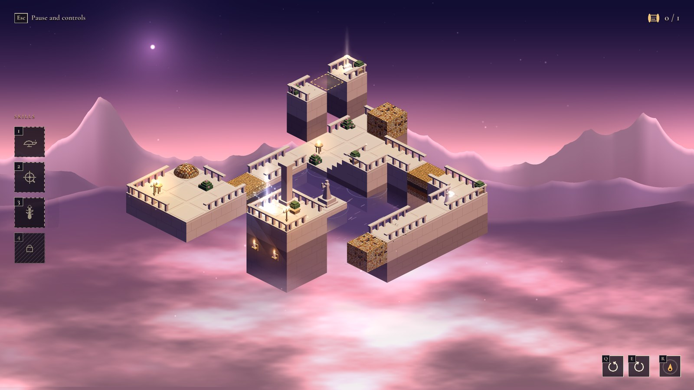
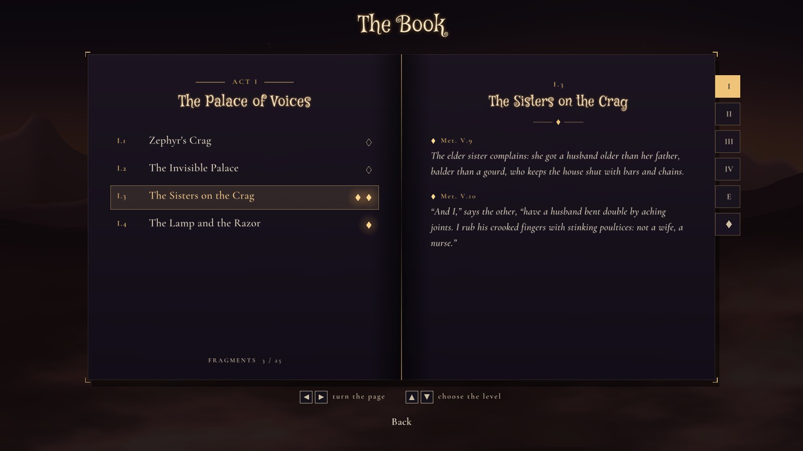

<div align="center">

# The Trial of Psyche

*An isometric puzzle about seeing and trusting,<br>
from Apuleius' tale of Cupid and Psyche (Metamorphoses IV–VI).*


<a href="LICENSE"></a>

<br><br>


</div>

<br>

<p align="center"><a href="https://github.com/pankaspe/the-trial-of-psyche/releases"></a></p>

An oracle sends Psyche to a lonely crag, dressed for a wedding of death. The wind
carries her to an invisible palace, where a husband she must never see comes to
her every night. Then come the sisters, a lamp, a drop of oil — and the long road
to win him back.

**The Trial of Psyche** follows that road in Apuleius' own order: a puzzle game in
the family of *Monument Valley*, built on one idea:

> **In the dark, what looks joined *is* joined.**

Turn the diorama and two stones that only *seem* to touch become a bridge; a stair
leads up only while you can see every step of it. Then Psyche takes the lamp, and
the light shows the truth — until the oil runs out.

<br>

<table>
  <tr>
    <td width="50%"></td>
    <td width="50%"></td>
  </tr>
  <tr>
    <td align="center"><sub><b>II.4 · The Temple of Ceres and Juno</b> — the lamp lit: the illusions crack</sub></td>
    <td align="center"><sub><b>III.1 · The House of Venus</b> — the ants carry the seeds along the way you see</sub></td>
  </tr>
  <tr>
    <td colspan="2"></td>
  </tr>
  <tr>
    <td colspan="2" align="center"><sub><b>The Book</b> — the fragments of the tale, gathered act by act</sub></td>
  </tr>
</table>

<br>

## The game

- **The tale, in order**: four acts and an epilogue, from the oracle to Olympus;
  each act opens with a short cutscene. Texts written anew from the Latin, in
  **Italian and English**.
- **Two new mechanics per act**: turning the diorama and the lamp (Act I), veiled
  stones and handles (Act II), the ants (Act III)… The other levels go deeper, not
  wider; the last ones of an act are real puzzles.
- **Fragments of the tale**, hidden and optional, gathered in the Book.
- **A place for every level**, with its own sky, light and sound; generative,
  dreamlike music that never repeats.
- **Room to experiment**: braziers bring you back, a held key restarts the level;
  accessibility options (HUD size, labels, reduced motion, endless oil).

**Status:** Acts I and II (eight levels) and the first level of Act III are
playable; the rest is being built, one level at a time.

<br>

## Everything is made in code

No image files: the palace, the figures, the sky and the mountains are built from
code at startup, and so is almost all of the sound.

| | |
|---|---|
| **Language** | [Odin](https://odin-lang.org), with [raylib 6](https://www.raylib.com) (OpenGL 3.3) |
| **Rendering** | true 3D with a hand-made isometric projection, so every illusion survives; meshes from lists of boxes; GLSL for light, sky, clouds and water |
| **Sound** | synthesised: a generative score per act (pads, Karplus–Strong lyre, flute, bells), soft effects, an FDN reverb; recorded footsteps (CC0) |
| **Levels** | text files; a solver plays each one through to prove it can be finished and that every fragment stays optional |

Developed with [Claude Code](https://claude.com/claude-code) (Anthropic) as a coding copilot.

<br>

## Play it

**Download** the Linux build (x86_64, glibc 2.29+) from the
[Releases](https://github.com/pankaspe/the-trial-of-psyche/releases) page, unpack it
and run `./trial-of-psyche`. Windows and macOS are not tested yet.

**From source**, with the [Odin compiler](https://odin-lang.org/docs/install/) (a recent `dev` build):

```bash
git clone https://github.com/pankaspe/the-trial-of-psyche.git
cd the-trial-of-psyche
./build.sh release && ./build/trial-of-psyche
```

`./build.sh test` runs the headless tests; `./build.sh check assets/levels/level_04.txt`
analyses a level.

| | Keyboard and mouse | Gamepad |
|---|---|---|
| walk | click | left stick or d-pad |
| turn the diorama | Q / E | LB / RB |
| the lamp | 1, L or right click | X |
| turn a handle (standing on it) | 2 or F | Y |
| call the ants (beside a seed) | 3 or Space | LT |
| into a cave | Space | A |
| back to the last brazier · hold: restart | R | B |
| pause | Esc | Start |

The HUD shows the buttons of the device used last (Xbox, PlayStation or Nintendo).

<br>

## License

The Trial of Psyche is free software, released under the
[GNU General Public License v3.0](LICENSE). You may study, change and share it;
if you distribute a modified version, it must stay under the same license, with
its source, and keep the copyright notices: credit where it is due.

Copyright © 2026 pankaspe.

Third-party material keeps its own license:
the fonts *Cormorant Garamond* and *Mystery Quest* (SIL Open Font License,
`assets/fonts/OFL-*.txt`); the footstep recordings and the shapes the pieces are
modelled after, from [Kenney](https://kenney.nl) (CC0).

<br>

<div align="center">

If you like what you see, you can support the work:

<a href="https://buymeacoffee.com/pankaspe"></a>

</div>
