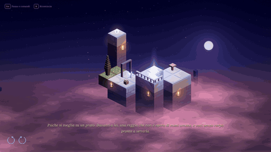

# The Trial of Psyche


[](https://buymeacoffee.com/pankaspe)

An isometric puzzle about seeing and trusting, from Apuleius' *Cupid and Psyche*
(Metamorphoses IV–VI). Turn the palace: in the dark, what looks joined *is*
joined, and stairs lead up only while you can see them. Then Psyche takes the
lamp, and the light shows the truth.



Nineteen levels in four acts and an epilogue, following the tale in Apuleius'
order. **Act I, *The Palace of Voices*, is playable**: the prologue on Zephyr's
crag, the first illusions, the climb to the sisters' crag and the night of the
lamp. Fragments of the tale wait on hidden spots, gathered in the Book.

Everything is made in code: the pieces, the figures, the sky, the sound.
Italian and English.

## Build and run

Needs the [Odin](https://odin-lang.org) compiler; raylib comes with Odin's vendor collection.

```bash
./build.sh            # debug build and run
./build.sh release    # optimised build
./build.sh test       # headless tests
```

**Controls**: click to walk · Q / E to turn the palace · Space or right click: the lamp ·
R: restart · Esc: pause and controls.

## Credits

Pieces modelled after Kenney's *Isometric Prototype Tiles* (CC0).
Font: Noto Serif (SIL Open Font License, `assets/fonts/OFL.txt`).
