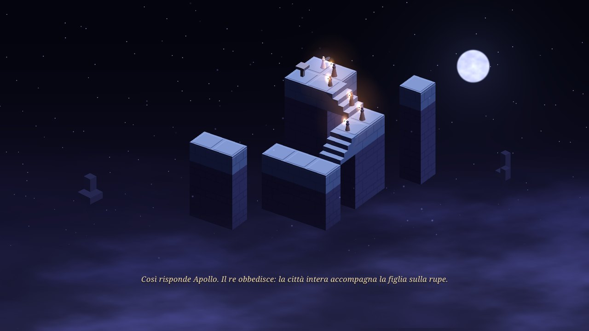
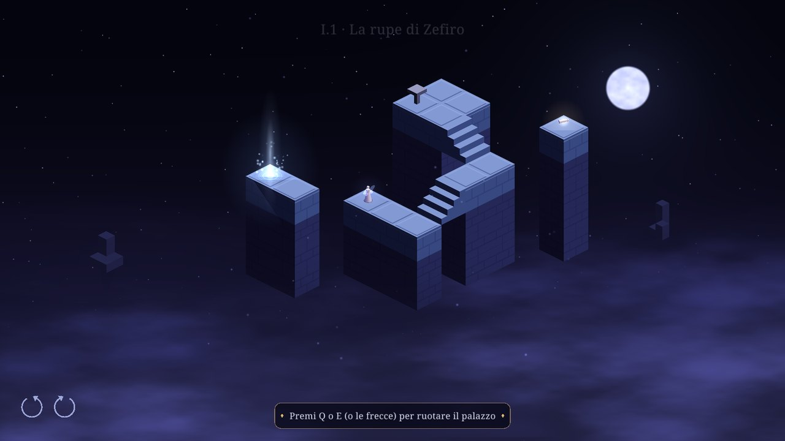
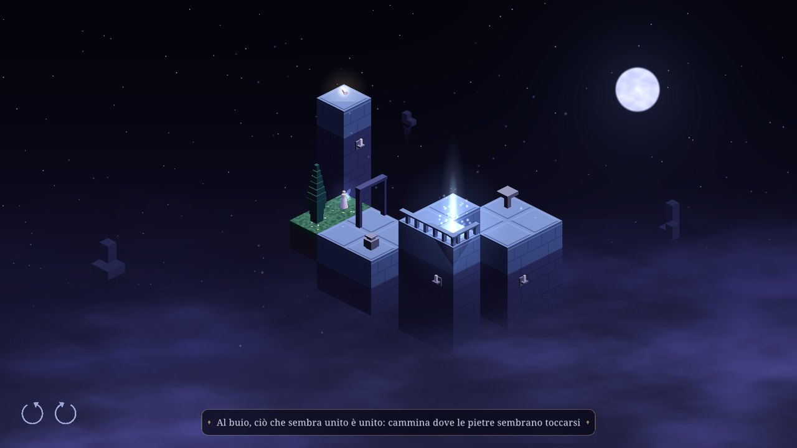
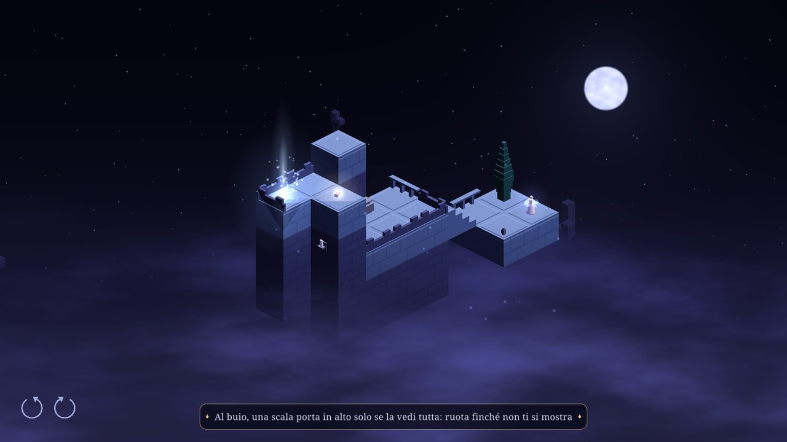
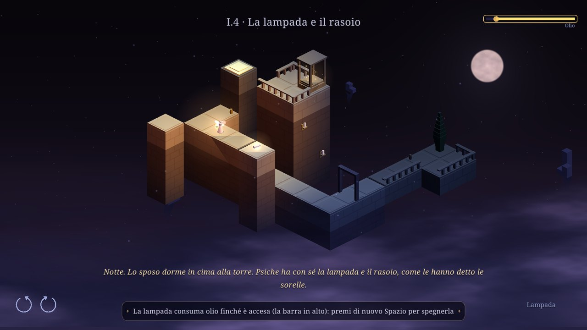
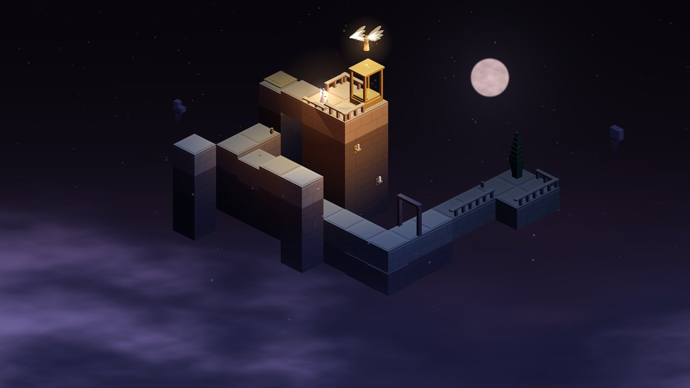
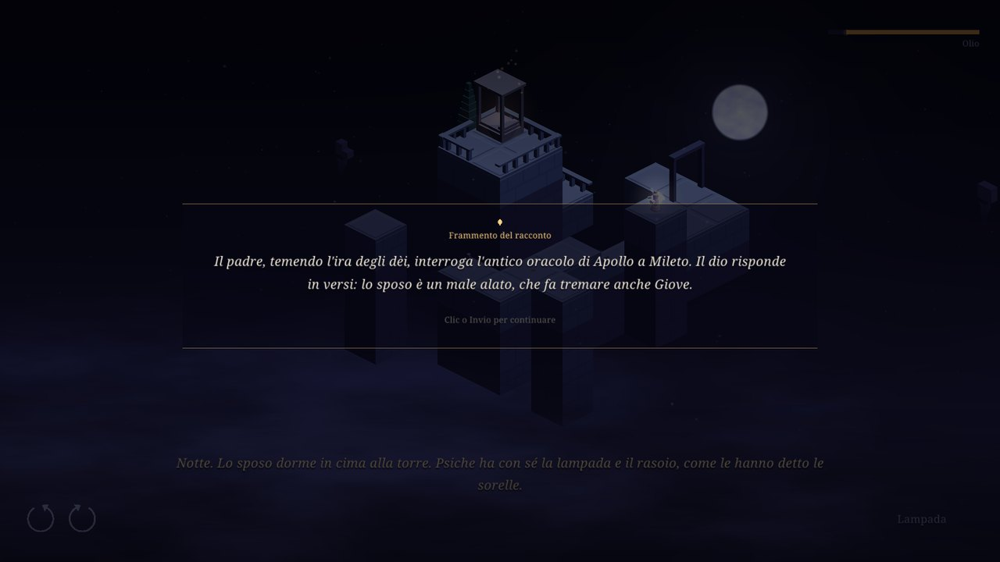

# The Trial of Psyche

An isometric puzzle about seeing and trusting, from Apuleius' *Cupid and Psyche*
(Metamorphoses IV–VI). In the dark, what looks joined *is* joined. The lamp
shows the truth — and breaks the paths you walk on.

Odin + raylib 6. Italian and English. Everything you see is built in code:
pieces from boxes and lathes, figures, sky, sound and music.

Twenty levels in four acts and an epilogue, following the tale in Apuleius'
order. **Act I, *The Palace of Voices*, is playable**: the prologue on Zephyr's
crag, the first illusions, the hidden stairs, and the night of the lamp.

| | |
| --- | --- |
|  |  |
| *The prologue: the wedding procession climbs the crag* | *I.1 Zephyr's Crag: turn the crag to find the wind* |
|  |  |
| *I.2 The Invisible Palace: in the dark, what seems joined is joined* | *I.3 The Sisters on the Crag: stairs you cannot see lead nowhere* |
|  |  |
| *I.4 The Lamp and the Razor: the lamp shows the truth, and burns its oil* | *The drop of oil: the canonical end of Act I* |


*Fragments of the Tale: twenty optional scrolls, one per level, gathered in the Book.*

## Build and run

```bash
./build.sh            # debug build and run
./build.sh release    # optimised build in build/trial-of-psyche
./build.sh test       # headless tests
./build.sh check assets/levels/level_04.txt   # level analysis
./build/trial-of-psyche-debug --shots DIR --size 1600x900 --level I.2   # screenshot tour of a level
```

Needs the Odin compiler (`odin` in PATH); raylib comes with Odin's vendor collection.

## Controls

Click: walk · Q / E or arrows: turn the palace · Space / L / right click: lamp ·
R: restart · Esc: pause (and the list of controls) · F11: fullscreen · F3: debug overlay

The first levels teach each control and each new rule once, when it is needed.

## Layout

```
src/
  main.odin        app: window, screens, settings, frame loop
  shots.odin       scripted screenshots (--shots DIR, --level ID)
  iso/             isometric grid math
  level/           level file parser
  palace/          walk graph, illusions, visibility, path finding
  game/            rules: lamp, oil, walking, turning, seal, fragments, endings,
                   tutorial hints, the prologue cutscene
  render/          3D palace, figures, sky, clouds, glows, particles
  ui/              fonts, widgets, HUD, menus
  audio/           procedural sound and music
  i18n/            every visible string, per language
  settings/        player options file
  progress/        save file: levels, fragments, achievements
  fx/              easing, RNG, particle pools
  content/         acts and levels, embedded assets (levels, shaders, fonts)
assets/            levels, GLSL shaders, fonts
docs/screenshots/  images for this page
tests/             headless tests
tools/level_check/ level analysis
```

## Credits

Pieces modelled after Kenney's *Isometric Prototype Tiles* (CC0).
Font: Noto Serif (SIL Open Font License, see `assets/fonts/OFL.txt`).
