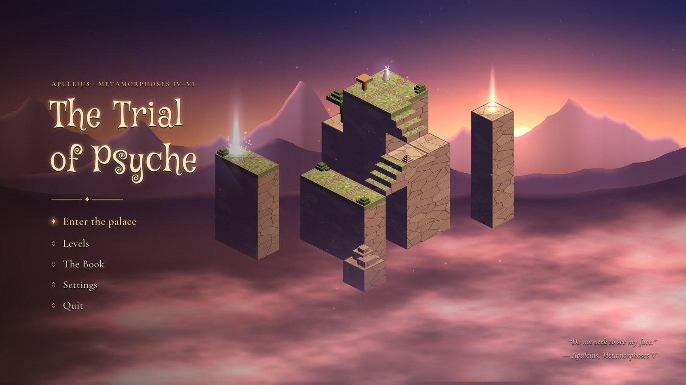
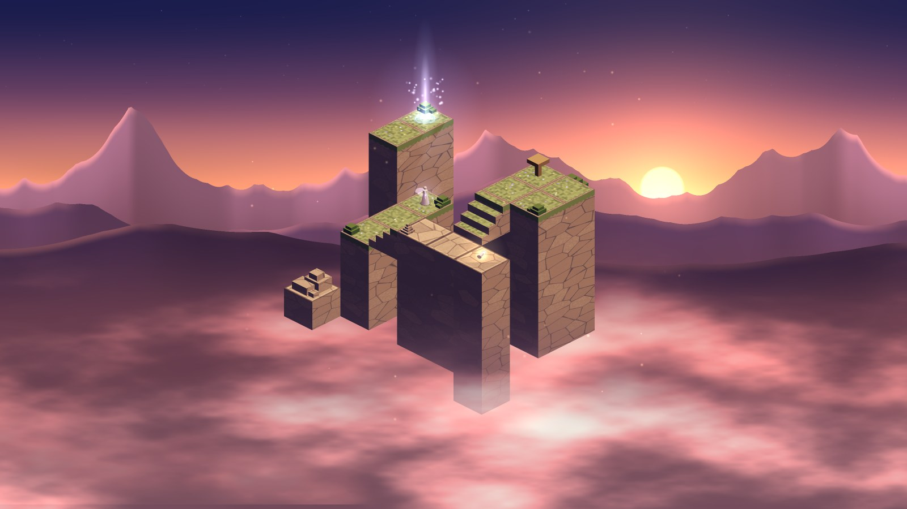
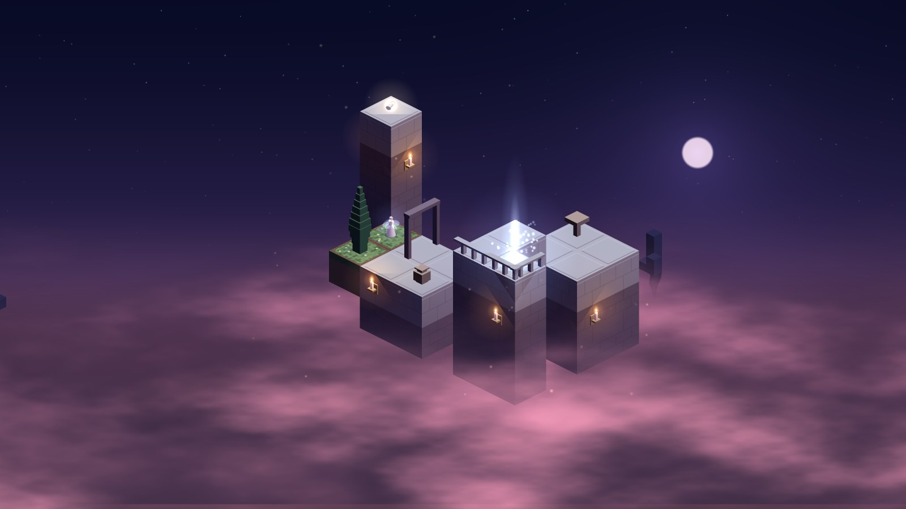
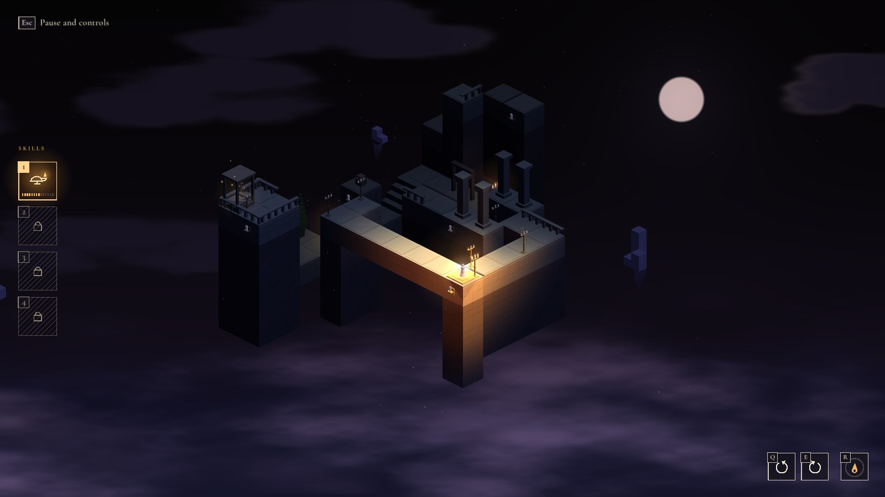
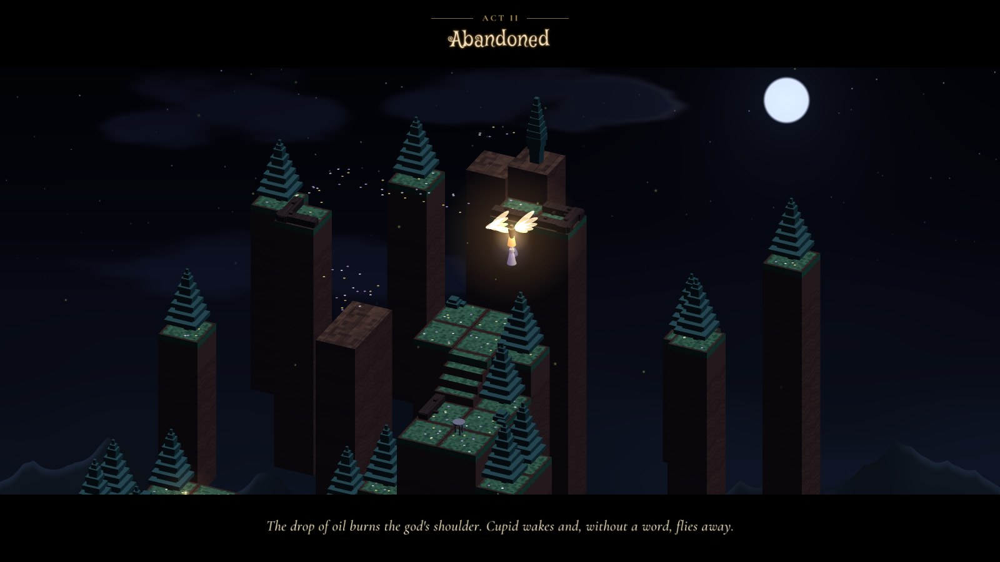
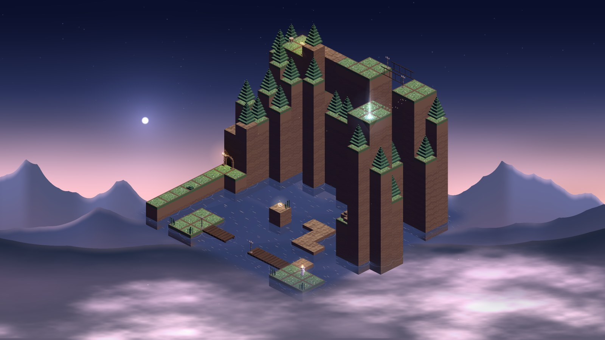
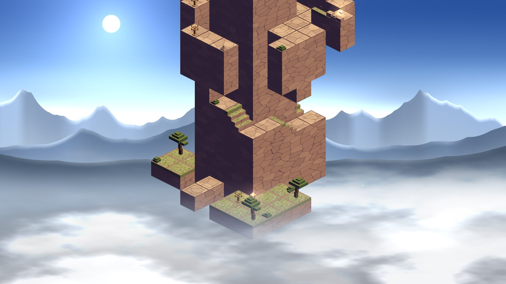
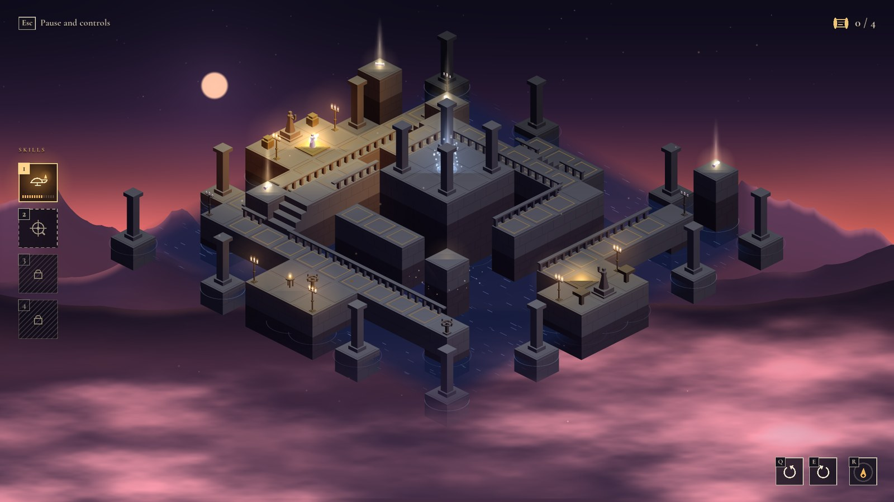

<div align="center">

# The Trial of Psyche

*An isometric puzzle about seeing and trusting,<br>
from Apuleius' tale of Cupid and Psyche (Metamorphoses IV–VI).*


<a href="LICENSE"></a>

<br><br>



</div>

<br>

An oracle sends Psyche to a lonely crag, dressed for a wedding of death. The wind
carries her to an invisible palace, where a husband she must never see comes to
her every night. Then come the jealous sisters, a lamp, a razor, a drop of oil —
and the long road to win him back.

**The Trial of Psyche** follows that road, level by level, in Apuleius' own order.
It is a puzzle game in the family of *Monument Valley*, built on one idea:

> **In the dark, what looks joined *is* joined.**

Turn the diorama and two stones that only *seem* to touch become a bridge. A
flight of stairs leads up only while you can see every step of it. Then Psyche
takes the lamp, and the light shows the truth: the illusions crack, hidden things
appear, the palace stops lying — and the oil runs out.

<br>

## Screenshots

<table>
  <tr>
    <td width="50%"></td>
    <td width="50%"></td>
  </tr>
  <tr>
    <td align="center"><sub><b>I.1 · Zephyr's Crag</b> — the prologue ends here, at sunset</sub></td>
    <td align="center"><sub><b>I.2 · The Invisible Palace</b> — the first illusions, at dusk</sub></td>
  </tr>
  <tr>
    <td></td>
    <td></td>
  </tr>
  <tr>
    <td align="center"><sub><b>I.4 · The Lamp and the Razor</b> — the seal, lit, has raised a bridge</sub></td>
    <td align="center"><sub><b>Act II opens</b> — Cupid flies away, Psyche clinging to him</sub></td>
  </tr>
  <tr>
    <td></td>
    <td></td>
  </tr>
  <tr>
    <td align="center"><sub><b>II.2 · The River and Pan</b> — two banks joined by a cave</sub></td>
    <td align="center"><sub><b>II.3 · The Sisters' Crag</b> — a spiral climb, turned by handles</sub></td>
  </tr>
  <tr>
    <td colspan="2"></td>
  </tr>
  <tr>
    <td colspan="2" align="center"><sub><b>II.4 · The Temple of Ceres and Juno</b> — two rings that turn about the altar: it looks easy</sub></td>
  </tr>
</table>

<br>

## The game

- **The tale, in order.** Four acts and an epilogue, from the oracle to the wedding
  on Olympus. Each act opens with a short cutscene; each level ends with a page of
  the story. All texts are written anew from the Latin, in **Italian and English**.
- **Two new mechanics per act, never more.** Act I: turning the diorama (and the
  stairs that work only while seen), then the lamp. Act II: veiled stones the
  light makes real, and handles that turn whole parts of the world. The other
  levels go deeper, not wider; the last levels of an act are real puzzles.
- **Fragments of the tale.** Hidden on hard-to-reach spots, optional, gathered in
  the Book in the order of Apuleius' text. The last one reveals who is telling
  the story.
- **A place for every level.** A crag at sunset, a palace at dusk, a forest of
  rock at the dead of night, a river at dawn, a temple over a sacred pool: each
  with its own sky, mountains, light and sound.
- **Dreamlike sound.** The music is generative and never repeats: slow pads, a
  lyre, a flute, far bells, a different voice for each act. The effects are
  synthesised, soft, in a vast space.
- **Room to experiment.** Some changes are for good, so a wrong move can cost
  the way: braziers bring you back, a held key restarts the level, and there are
  accessibility options (HUD size, labels, reduced motion, endless oil).

**Status:** Acts I and II are playable (eight levels). Acts III, IV and the
epilogue are being built, one level at a time.

<br>

## Everything is made in code

There are no image files in the game. The palace, the rocks, the trees, the
figures, the sky and the mountains are built from code at startup; so is almost
all of the sound.

| | |
|---|---|
| **Language** | [Odin](https://odin-lang.org) |
| **Graphics, input, audio device** | [raylib 6](https://www.raylib.com), from Odin's vendor collection; OpenGL 3.3 |
| **Rendering** | true 3D with a hand-made isometric projection (so every illusion of the 2D design survives); meshes from lists of boxes; GLSL shaders for the stones' light (moon, sunset, lamp, candles), the sky, the parallax ranges, clouds, water and the veil between levels |
| **Graphics quality** | Low (drawn smaller), Medium, High (MSAA 4×), Ultra (2× supersampling), switchable live |
| **Sound** | synthesised at startup and in real time: a generative score per act (additive pads, Karplus–Strong lyre, flute, glass bells), effects from modal and filtered-noise synthesis, an 8-line FDN reverb; recorded footsteps (CC0) |
| **Levels** | plain text files, embedded in the binary; a solver plays every level move by move to prove it can be finished, find shortcuts and dead ends, and check that every fragment stays optional |
| **Tests** | headless: rules, illusions, every level solved and played through the game, saves, settings, sound |

Developed with [Claude Code](https://claude.com/claude-code) (Anthropic) as a coding copilot.

<br>

## Play it

The game is in development and builds on **Linux** for now (Windows and macOS
should follow: raylib and Odin support them, but they are not tested yet at the moment).

<p align="center"><a href="https://github.com/pankaspe/the-trial-of-psyche/releases"></a></p>

**Download:** a ready-to-run Linux build (x86_64, glibc 2.29 or newer) is on the
[Releases](https://github.com/pankaspe/the-trial-of-psyche/releases) page: unpack it
and run `./trial-of-psyche`.

**From source:** you need the [Odin compiler](https://odin-lang.org/docs/install/) (a recent `dev`
build; raylib comes with it) and a GPU with OpenGL 3.3.

```bash
git clone https://github.com/pankaspe/the-trial-of-psyche.git
cd the-trial-of-psyche
./build.sh release            # optimised build: build/trial-of-psyche
./build/trial-of-psyche
```

Other commands: `./build.sh` (debug build and run), `./build.sh test` (the
headless tests), `./build.sh check assets/levels/level_04.txt` (a level's
analysis: illusions per view, the solver's plan).

### Controls

| | Keyboard and mouse | Gamepad |
|---|---|---|
| walk | click | left stick or d-pad |
| turn the diorama | Q / E (or ← / →) | LB / RB |
| the lamp | 1, L or right click | X |
| turn a handle (standing on it) | 2 or F | Y |
| the action of the place (into a cave) | Space | A |
| tap: back to the last brazier · hold: restart the level | R | B |
| pause and controls | Esc · F11 fullscreen | Start |

The game is fully playable with a gamepad: the HUD shows the buttons of the
device used last (Xbox, PlayStation or Nintendo marks, or chosen in the
settings), and the menus are walked with the d-pad, A to choose, B to go back.

<br>

## License

The Trial of Psyche is free software, released under the
[GNU General Public License v3.0](LICENSE). You may study, change and share it;
if you distribute a modified version, it must stay under the same license, with
its source, and keep the copyright notices: credit where it is due.

Copyright © 2026 pankaspe.

Third-party material keeps its own license:
the fonts *Cormorant Garamond* and *Mystery Quest* (SIL Open Font License,
`assets/fonts/OFL-*.txt`); the footstep recordings and the shapes the pieces are
modelled after, from [Kenney](https://kenney.nl) (CC0).

<br>

<div align="center">

If you like what you see, you can support the work:

<a href="https://buymeacoffee.com/pankaspe"></a>

</div>
